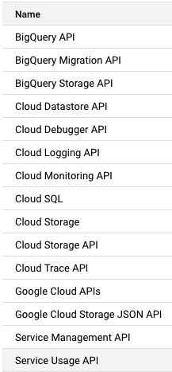
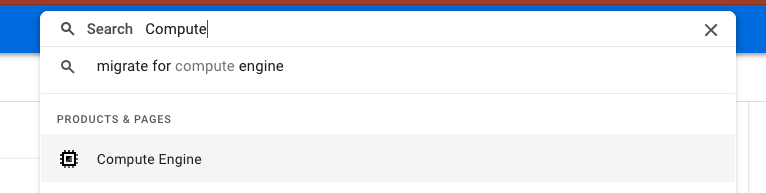
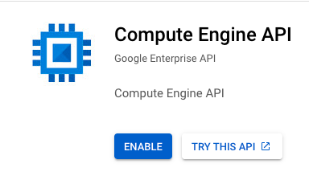

# Setup instructions

You will find below the instructions to set up your computer for [Le Wagon Data Engineering course](https://www.lewagon.com/)

A part of the setup will be done on your **local machine** but most of the configuration will be done on a **virtual machine**.

Please **read instructions carefully and execute all commands in the following order**. If you get stuck, don't hesitate to ask a teacher for help :raising_hand:

This setup is largely automated with **Terraform** and **Ansible**. There are three main components to the setup! **Terraform** and **ansible** are _Infrastructure as Code_ tools.
- **Terraform** excels at creating and destroying cloud resources, like virtual machines, IP addresses, databases and more!
- **Ansible** is used to configure linux machines with specific settings and software. Perfect for fine-tuning the Virtual Machine you will be creating!

## Part 1: Setup your local computer

In this section you'll setup your local computer and create some accounts. It will include things like:
1. Install some communication tools: Zoom, Slack
2. Create some accounts: Github, Google Cloud Platform (GCP)
3. Install Visual Studio Code (VS Code)
4. Install and authentication the GCP command line tool: `gcloud`
5. Install **terraform** on your local computer
6. Create your virtual machine with **terraform** and connect to it with **VS Code**!

## Part 2: Configure your Virtual Machine Part 1

All parts of this section happen on your virtual machine.

This section includes:
1. Authenticate your virtual machine with `gcloud`
2. Download and run an **ansible** playbook to partially configure your virtual machine
3. Login to the Github command line tool on your virtual machine
4. Copy the Le Wagon recommended **dotfiles**. **Dotfiles** are settings that will enhance your terminal and developer experience!

## Part 3: Configure your Virtual Machine Part 2

All parts of this section happen on your virtual machine.

In this section you will:
1. Download and run a second **ansible** playbook for some more fine tuning
2. Test your set up to make sure that everything has installed correctly
3. Create isolated python environments for all your challenges


Don't worry, we'll go into more detail in each of the individual sections.

Let's start :rocket:


## Zoom

To be able to interact when we are not in the same physical room, we will be using [Zoom](https://zoom.us/), a video conferencing tool.

:warning: If you already have Zoom installed, please make sure that the version is at least **5.6**.

Go to [zoom.us/download](https://zoom.us/download).

Under **Zoom Client** click the **Download** button.

Open the file you have just downloaded to install the app.

Open the Zoom app.

If you already have a Zoom account, sign in using your credentials.

If not, click on the **Sign Up Free** link:


You will be redirected to Zoom's website to complete a form.

When it's done, go back to the Zoom app and sign in using your credentials.

You should then see a screen like this:


You can now close the Zoom app.


## Slack

[Slack](https://slack.com/) is a communication platform pretty popular in the tech industry.

### Installation

[Download the Slack app](https://get.slack.help/hc/en-us/articles/212924728-Slack-for-Linux-beta-) and install it.

:warning: If you are already using Slack in your browser, please download and install **the desktop app** which is fully featured.


### Settings

Launch the app and sign in to `lewagon-alumni` organization.

Make sure you **upload a profile picture** :point_down:


The idea is that you'll have Slack open all day, so that you can share useful links / ask for help / decide where to go to lunch / etc.

To ensure that everything is working fine for video calls, let's test your camera and microphone:
- Open the Slack app
- Click your profile picture in the top right.
- Select `Preferences` from the menu.
- Click `Audio & video` in the left-side column.
- Below `Troubleshooting`, click `Run an audio, video and screensharing test`. The test will open in a new window.
- Check that your preferred speaker, microphone and camera devices appear in the drop-down menus, then click `Start test`.


:heavy_check_mark: When the test is finished, you should see green "Succeed" messages at least for your microphone and camera. :+1:

:x: If not, **contact a teacher**.

You can also install Slack app on your phone and sign in `lewagon-alumni`!


## GitHub account

Have you signed up to GitHub? If not, [do it right away](https://github.com/join).

:point_right: **[Upload a picture](https://github.com/settings/profile)** and put your name correctly on your GitHub account. This is important as we'll use an internal dashboard with your avatar. Please do this **now**, before you continue with this guide.


:point_right: **[Enable Two-Factor Authentication (2FA)](https://docs.github.com/en/authentication/securing-your-account-with-two-factor-authentication-2fa/configuring-two-factor-authentication#configuring-two-factor-authentication-using-text-messages)**. GitHub will send you text messages with a code when you try to log in. This is important for security and also will soon be required in order to contribute code on GitHub.


## Chrome - your browser

Install the Google Chrome browser if you haven't got it already and set it as a __default browser__.

Follow the steps for your system from this link :point_right: [Install Google Chrome](https://support.google.com/chrome/answer/95346?co=GENIE.Platform%3DDesktop&hl=en-GB)

__Why Chrome?__

We recommend to use it as your default browser as it's most compatible with testing or running your code, as well as working with Google Cloud Platform. Another alternative is Firefox, however we don't recommend using other tools like Opera, Internet Explorer or Safari.


## Google Cloud Platform setup

[GCP](https://cloud.google.com/) is a cloud solution that you are going to use in order to work on a virtual machine.

### Project setup

**👌 Note: Skip to the next section if you already have a GCP project**

- Go to [Google Cloud](https://console.cloud.google.com/) and create an account if you do not already have one
- In the Cloud Console, on the project list, select or create a Cloud project


- Give it a name such as `Wagon Bootcamp` for example
- Notice the `ID` automatically created for the project, e.g. `wagon-bootcamp-123456`


### Account language

In order to facilitate the following of the instructions during the bootcamp, open your GCP account preferences:

https://myaccount.google.com/language

If the *preferred language* is not:
- **English**
- **United States**

Then switch the language to english:
- Click on the edit pen logo
- Select **English**
- Select **United States**
- Click on **Select**

### Billing account

**👌 Note: Skip to the next section if you already have a valid billing account**

You will now link your account to your credit card. This step is required or you will not be able to use the services provided by GCP. Do not worry, you will be able to consume most GCP services through free credits throughout the bootcamp.


- Click on **Billing**
- Click on **MANAGE BILLING ACCOUNTS**
- Click on **ADD BILLING ACCOUNT**
- Give a name to your billing account, e.g. `My Billing Account`
- Click on "I have read..." and agree the to the terms of service
- Click on **CONTINUE**
- Select your account type: `Individual`
- Fill your name and address

You should see that you have a free credit of "$300 credits over the next 90days".

- Click on card details
- Enter your credit card info
- Click on **START MY FREE TRIAL**

Once this is done, verify that your billing account is linked to your GCP project.

- Select your project
- Go to **Billing**
- Select **LINK A BILLING ACCOUNT**
- Select `My Billing Account`
- Click on **SET ACCOUNT**

You should now see:

```
Free trial status: $300 credit and 91 days remaining - with a full account, you'll get unlimited access to all of Google Cloud Platform.
```

<details>
  <summary>👉 If you do not own a credit card 👈</summary>


If you do not own a credit card, an alternative is to setup a **Revolut** account.
Revolut is a financial app that will allow you to create a virtual credit card linked to your mobile phone billing account.

Skip this step if you own a credit card and use your credit card for the setup.

Download the Revolut app, or go to [revolut](https://www.revolut.com/a-radically-better-account) and follow the steps to download the app (enter your mobile phone number and click on Get Started).

- Open the Revolut app
- Enter your mobile phone number
- Enter the verification code received by SMS
- The app will ask for your country, address, first and last name, date of birth, email address
- The app will also ask for a selfie and request your profession
- The app will require a photo of your identification card or passport

Once this is done, select the standard (free) plan. No need to add the card to Apple pay, or ask for a the delivery of a physical card, or add money securely.

You now have a virtual card which we will use for the GCP setup.

In the main view of the Revolut the app
- Click on Ready to use
- Click on the card
- Click on Show card details
- Note down the references of the virtual credit card and use them in order to proceed with the GCP setup

</details>

<details>
  <summary>👉 If you receive an email from Google saying "Urgent: your billing account XXXXXX-XXXXXX-XXXXXX has been suspended" 👈</summary>


This may happen especially in case you just setup a Revolut account.

- Click on PROCEED TO VERIFICATION
- You will be asked to send a picture of your credit card (only the last 4 digits, no other info)
- In case you used **Revolut**, you can send a screenshot of your virtual credit card (do not forget to remove the validity date from the screenshot)
- Explain that you are attending the Le Wagon bootcamp, do not own a credit card, and have just created a Revolut account in order to setup GCP for the bootcamp using a virtual credit card

You may receive a validation or requests for more information within 30 minutes.

Once the verification goes through, you should receive an email stating that "Your Google Cloud Platform billing account XXXXXX-XXXXXX-XXXXXX has been fully reinstated and is ready to use.".

</details>

## GCP APIs

You will use different GCP services during the bootcamp which needs to be activated and configured.

### Default APIs

Go to your project [APIs dashboard](https://console.cloud.google.com/apis/dashboard), you can see a bunch of APIs are already enabled:



### Enable Compute Engine (virtual machines) API

**👌 Note: Skip to the next section if you already have Compute Engine enabled**

- In the search bar, type _compute_ and click on the Compute Engine result
    
- Click on `ENABLE`

    
- Compute Engine is now enabled on your project


## Visual Studio Code

### Installation

Let's install [Visual Studio Code](https://code.visualstudio.com) text editor.

Copy (`Ctrl` + `C`) the commands below then paste them in your terminal (`Ctrl` + `Shift` + `v`):

```bash
wget -qO- https://packages.microsoft.com/keys/microsoft.asc | gpg --dearmor > packages.microsoft.gpg
```

```bash
sudo install -o root -g root -m 644 packages.microsoft.gpg /etc/apt/trusted.gpg.d/
```

```bash
sudo sh -c 'echo "deb [arch=amd64,arm64,armhf signed-by=/etc/apt/trusted.gpg.d/packages.microsoft.gpg] https://packages.microsoft.com/repos/code stable main" > /etc/apt/sources.list.d/vscode.list'
```

```bash
rm -f packages.microsoft.gpg
```

```bash
sudo apt update
```

```bash
sudo apt install -y code
```

These commands will ask for your password: type it in.

:warning: When you type your password, nothing will show up on the screen, **that's normal**. This is a security feature to mask not only your password as a whole but also its length. Just type in your password and when you're done, press `Enter`.

### Launching from the terminal

Now let's launch VS Code from **the terminal**:

```bash
code
```

:heavy_check_mark: If a VS Code window has just opened, you're good to go :+1:

:x: Otherwise, please **contact a teacher**


### VS Code Remote SSH Extension

We need to connect VS Code to a virtual machine in the cloud so you will only work on that machine during the bootcamp. A pretty useful [**Remote SSH Extension**](https://marketplace.visualstudio.com/items?itemName=ms-vscode-remote.remote-ssh) is available on the VS Code Marketplace.

- Open VS Code > Open the [command palette](https://code.visualstudio.com/docs/getstarted/userinterface#_command-palette) > Type `Extensions: Install Extensions`


- Install the extension


That's the only extension you should install on your _local_ machine, we will install additional VS Code extensions on your _virtual machine_.


## Google Cloud CLI

The `gcloud` Command Line Interface (CLI) is used to communicate with Google Cloud Platform services through your terminal.

### Install gcloud

Add the `APT` repository and install with:

```bash
echo "deb [signed-by=/usr/share/keyrings/cloud.google.gpg] https://packages.cloud.google.com/apt cloud-sdk main" | sudo tee -a /etc/apt/sources.list.d/google-cloud-sdk.list
sudo apt-get install apt-transport-https ca-certificates gnupg
curl https://packages.cloud.google.com/apt/doc/apt-key.gpg | sudo apt-key --keyring /usr/share/keyrings/cloud.google.gpg add -
sudo apt-get update && sudo apt-get install google-cloud-sdk
sudo apt-get install google-cloud-sdk-app-engine-python
```

To test your install, open a new terminal and run:

```bash
gcloud --version
```
👉 [Install documentation 🔗](https://cloud.google.com/sdk/docs/install#deb)


### Authenticate gcloud

We need to authenticate the `gcloud` CLI tool and set the project so it can interact with Google from the terminal.

To authenticate `gcloud`, run:

```bash
gcloud auth login
```

And following the prompts. For pasting into the terminal, your might need to use CTRL + SHIFT + V

You also need to set the GCP project that your are working in. For this section, you'll need your GCP Project ID, which can be found on the GCP Console at this [link here](https://console.cloud.google.com). Makes sure you copy the _Project ID_ and **not** the _Project number_.

To set your project, replace `<YOUR_PROJECT_ID>` with your GCP Project ID and run:

```bash
gcloud config set project <YOUR_PROJECT_ID>
```

Confirm your setup with:

```bash
gcloud config list
```

You should get an output similar to:

```bash
[core]
account = taylorswift@domain.com # Should be your GCP email
disable_usage_reporting = True
project = my-gcp-project # Should be your GCP Project ID

Your active configuration is: [default]
```


### Application Default Credentials

Application Default Credentials are for authenticating our **code** (Terraform and Python 🐍) to interact with Google services and resources. It's a small distinction between `gcloud` and **code**, but an important one.

To authenticate your **Application Default Credentials**, in your terminal run:

```bash
gcloud auth application-default login
```

And follow the prompts. It should open a web-page to login to your Google account.


## Terraform

Terraform is a tool for infrastructure as code (IAC) to create (and destroy) resources to create in the cloud.

Install some basic requirements:
```bash
sudo apt-get update && sudo apt-get install -y gnupg software-properties-common
```

Terraform is not available to **apt** by default, so we need to manually add the repository.
```bash
wget -O- https://apt.releases.hashicorp.com/gpg | \
    gpg --dearmor | \
    sudo tee /usr/share/keyrings/hashicorp-archive-keyring.gpg > /dev/null
```

```bash
gpg --no-default-keyring \
    --keyring /usr/share/keyrings/hashicorp-archive-keyring.gpg \
    --fingerprint
```

```bash
echo "deb [signed-by=/usr/share/keyrings/hashicorp-archive-keyring.gpg] \
    https://apt.releases.hashicorp.com $(lsb_release -cs) main" | \
    sudo tee /etc/apt/sources.list.d/hashicorp.list
```

Now we can install terraform directly with **apt** 👇
```bash
sudo apt update
sudo apt-get install terraform
```

Verify the installation with:

```bash
terraform --version
```


## Provisioning your Virtual Machine with Terraform

You can create Cloud Resources like Virtual Machines in different ways:
- Through the Google Cloud [Compute Engine Console 🔗](https://console.cloud.google.com/compute/overview)
- Using `gcloud`
- With **Infrastructure as Code** tools like Terraform

We'll be creating our Virtual Machine with Terraform

We're almost at the point of creating your Virtual Machine.

The specifications of the Virtual Machine and Network Settings you'll use for the bootcamp are:
- Operation System: Ubuntu 22.04 LTS
- CPU: 4 Virtual CPU cores (2 physical CPU cores)
- RAM: 16 GB
- Storage (Persistent Disk): 100 GB balanced
- Static External IP address - so it's easier to login.

### Cost 💸

Creating and running a Virtual Machine on Google Cloud Platform costs money!

If you have created a new Google Cloud Platform account, the cost of the Virtual machine will be covered by the $300 USD credit for the first 90 days if you are diligent with turning off your Virtual Machine (or finish the _Linux and Bash_ challenge today 😎).

❗ **The cost of running a Virtual Machine with our configuration 24 hours a day, 7 days a week is ~$150 USD per month.** ❗

You can massively reduce the cost by only running the Virtual Machine when you use it. You will _NOT_ be charged for the vCPU's and RAM while the Virtual Machine is off!

You will always pay for the Storage (equivalent of your hard-drive on your local computer). It's ~$10 USD per month for 100 GB.

The rule of thumb is: if Google can rent the resource out to someone else when your not using it, you only pay for it when you are using the resource. That's why you don't pay for the CPU and RAM when you are not using it, Google can rent it out to someone else, but always pay for Storage, Google can't rent it out to someone else because it has your data on it.

### Download terraform files

We almost have all the necessary parts to create your VM using **terraform**. We need to download the terraform files and change a few values.

First we'll create a folder and download the terraform files with:

```bash
mkdir -p ~/code/wagon-de-bootcamp
curl -L -o ~/wagon-de-bootcamp/main.tf https://raw.githubusercontent.com/lewagon/data-engineering-setup/lorcanrae/automated-setup/automation/infra/main.tf
curl -L -o ~/wagon-de-bootcamp/provider.tf https://raw.githubusercontent.com/lewagon/data-engineering-setup/lorcanrae/automated-setup/automation/infra/provider.tf
curl -L -o ~/wagon-de-bootcamp/variables.tf https://raw.githubusercontent.com/lewagon/data-engineering-setup/lorcanrae/automated-setup/automation/infra/variables.tf
curl -L -o ~/wagon-de-bootcamp/terraform.tfvars https://raw.githubusercontent.com/lewagon/data-engineering-setup/lorcanrae/automated-setup/automation/infra/terraform.tfvars
curl -L -o ~/wagon-de-bootcamp/.terraform.lock.hcl https://raw.githubusercontent.com/lewagon/data-engineering-setup/lorcanrae/automated-setup/automation/infra/.terraform.lock.hcl
```


### Set variables

Open up the file `~/wagon-de-bootcamp/terraform.tfvars` in VS Code or any other code editor.

It should look like:

```bash
project_id    = "<YOUR_GCP_PROJECT>"
region        = "<YOUR_GCP_REGION>"
zone          = "<YOUR_GCP_ZONE>"
instance_name = "<YOUR_GCP_INSTANCE_NAME>"
instance_user = "<YOUR_COMPUTER_USER_NAME>"
```

We'll need to change some values in this file. Here's were you can find the required values:
- **project_id:** from the GCP Console at this [link here](https://console.cloud.google.com).
- **region:** take a look at the GCP Region and Zone documentation at this [link here](https://cloud.google.com/compute/docs/regions-zones). We strongly recommend you choose the closest geographical region.
- **zone:** Zone is a subset of region. it is almost always the same as **region** appended with `-a`, `-b`, or `-c`.
- **instance_name:** we recommend naming your VM: `lw-de-vm-<YOUR_GITHUB_USERNAME>`. Replacing `<YOUR_GITHUB_USERNAME>` with your GitHub username.
- **instance_user:** in your terminal, run `whoami`

After completing this file, it should look similar to:

```bash
project_id    = "wagon-bootcamp"
region        = "europe-west1"
zone          = "europe-west1-b"
instance_name = "lw-de-vm-tswift"
instance_user = "taylorswift"
```

Make sure to save the `terraform.tfvars` file, nagivate into the directory with the terraform files with:

```
cd ~/wagon-de-bootcamp
```

And initialise and test the files with:

```bash
terraform init

terraform plan
```

And check the output. Towards the bottom there should be a line:

```
Plan: 2 to add, 0 to change, 0 to destroy
```

We'll be adding:
- A compute engine instance
- A static external IP address

❗ If you have any errors, read the error and debug. If you need some help, raise a ticket with a teacher.

If everything was successful, create your VM with:

```bash
terraform apply -auto-approve
```

It might take a while for Terraform to create the cloud resources. Once you see:

```
Apply complete! Resources: 2 added, 0 changed, 0 destroyed.
```

Your Virtual Machine should be up and running! Check the GCP Compute Engine console at this [link here](https://console.cloud.google.com/compute/instances) to confirm.


## Virtual Machine connection

### Create SSH keys

We need to connect VS Code to our Virtual Machine in the cloud so you will only work on that machine during the bootcamp. We'll use the [Remote - SSH Extension](https://marketplace.visualstudio.com/items?itemName=ms-vscode-remote.remote-ssh) that we previously installed.

To create the VS Code SSH configuration, run the following in your terminal:

```bash
gcloud compute config-ssh
```

`gcloud` may tell you it needs to create a directory to continue. Accept and you should get an output similar to:

```bash
You should now be able to use ssh/scp with your instances.
For example, try running:

  $ ssh lw-de-vm-tswift.europe-west1-b.wagon-bootcamp
# $ ssh lw-de-vm-<GITHUB_USERNAME>.<GCP_ZONE>.<GCP_PROJECT_ID>
```


### Connect with VS Code

To connect to your Virtual Machine, click on the small symbol at the very bottom-left corner of VS Code:


It should bring up a menu, click on **Connect to Host...**:


Click on the name of your Virtual Machine:


A new VS Code window will open. You may be asked to select the platform of the remote host, select **Linux**. You will then be asked to _fingerprint_ the connection. VS Code is asking if you trust the remote host you are trying to connect to. Hit enter to continue.


And you are connected! It should look similar too:


Notice the connection in the very bottom-left corner of your VS Code window. It should have the Connection type (SSH), and the name of the host you are connected to.

**The setup of your local machine is over. All following commands will be run from within your 🚨 virtual machine**🚨 terminal (via VS Code)

<details>
<summary markdown='span'>Viewing your SSH Configuration</summary>

If you want to view your SSH configuration:
1. Start by clicking the symbol in the bottom-left corner of VS Code
2. Click on **Connect to Host...**
3. Click on **Configure SSH Hosts...***
4. Select the configuration file. Usually the file at the top of the list.
5. View your configuration file! You may need to edit this configuration if you change computers, or want to work on more than one computer during the bootcamp.

</details>


## VM gcloud and Application Default Credentials

We'll be doing some of the steps again, but that's because the virtual machine is a completely new computer! Luckily for us, `gcloud` comes pre-installed on the virtual machine.


### Authenticate gcloud

We need to authenticate the `gcloud` CLI tool and set the project so it can interact with Google from the terminal.

To authenticate `gcloud`, run:

```bash
gcloud auth login
```

And following the prompts. For pasting into the terminal, your might need to use CTRL + SHIFT + V

You also need to set the GCP project that your are working in. For this section, you'll need your GCP Project ID, which can be found on the GCP Console at this [link here](https://console.cloud.google.com). Makes sure you copy the _Project ID_ and **not** the _Project number_.

To set your project, replace `<YOUR_PROJECT_ID>` with your GCP Project ID and run:

```bash
gcloud config set project <YOUR_PROJECT_ID>
```

Confirm your setup with:

```bash
gcloud config list
```

You should get an output similar to:

```bash
[core]
account = taylorswift@domain.com # Should be your GCP email
disable_usage_reporting = True
project = my-gcp-project # Should be your GCP Project ID

Your active configuration is: [default]
```


### Application Default Credentials

Application Default Credentials are for authenticating our **code** (Terraform and Python 🐍) to interact with Google services and resources. It's a small distinction between `gcloud` and **code**, but an important one.

To authenticate your **Application Default Credentials**, in your terminal run:

```bash
gcloud auth application-default login
```

And follow the prompts. It should open a web-page to login to your Google account.


## VM configuration with Ansible

We'll be using [Ansible](https://docs.ansible.com/ansible/latest/getting_started/introduction.html) to configure your Virtual Machine with some software, configurations, packages, and frameworks that you'll use in the bootcamp.

Let's start by confirming that ansible is installed. In your terminal run:

```bash
ansible --version
```

You should get an output similar to (some version numbers might change, that's fine):

```
ansible [core 2.17.9]
  config file = /etc/ansible/ansible.cfg
  configured module search path = ['/home/tswift/.ansible/plugins/modules', '/usr/share/ansible/plugins/modules']
  ansible python module location = /usr/lib/python3/dist-packages/ansible
  ansible collection location = /home/tswift/.ansible/collections:/usr/share/ansible/collections
  executable location = /usr/bin/ansible
  python version = 3.12.3 (main, Feb  4 2025, 14:48:35) [GCC 13.3.0] (/usr/bin/python3)
  jinja version = 3.1.2
  libyaml = True
```

❗ If not, raise a ticket with a teacher.

### Ansible Playbook 1

Create a folder and download the ansible files:

```bash
mkdir -p ~/vm-ansible-setup/playbooks

curl -L -o ~/vm-ansible-setup/ansible.cfg https://raw.githubusercontent.com/lewagon/data-engineering-setup/lorcanrae/automated-setup/automation/vm-ansible-setup/ansible.cfg
curl -L -o ~/vm-ansible-setup/hosts https://raw.githubusercontent.com/lewagon/data-engineering-setup/lorcanrae/automated-setup/automation/vm-ansible-setup/hosts
curl -L -o ~/vm-ansible-setup/playbooks/setup_vm_part1.yml https://raw.githubusercontent.com/lewagon/data-engineering-setup/lorcanrae/automated-setup/automation/vm-ansible-setup/playbooks/setup_vm_part1.yml
```

And run with:

```bash
cd ~/vm-ansible-setup
ansible-playbook playbooks/setup_vm_part1.yml
```

And the playbook should start running!

❗ If an errors occur, raise a ticket with a teacher. You can safely run the playbook again.

### What is the playbook installing?

This playbook is installing a few things, while the playbook is running, let's go through them:
- Updating system packages. Ubuntu uses the `APT` package manager.
- Changing the default shell from **bash** to **zsh**, a more customizable shell that is extensible and looks great!
- Installing the **Oh-My-ZSH** plugin for the **zsh** shell. We'll use it a bit later to add some quality of life plugins and extensions for `zsh`.
- Installing **Docker** on your Virtual Machine. Docker is an open platform for developing, shipping, and running applications. You will use it throughout the bootcamp
- Installing some **Kubernetes (k8s)** tooling: Kubernetes is a system designed to for auto-scaling containerized applications.
    - Installing **kubectl**: `kubectl` is the CLI tool for interacting with kubernetes clusters.
    - Installing **minikube**: Minikube is a way to quickly spin up a local kubernetes cluster. Great for developing!
- Installing **terraform**: we've already installed it once, but we need to install it on our VM! **Terraform** is an Infrastructure as Code (IaC) tool.
- Install the **GitHub CLI**: the CLI tool that we'll use to interact with your GitHub account directly from the terminal.

The playbook is also running checks to see if things are installed or not. This is so you can safely re-run the playbook without any problems.


## GitHub CLI

CLI is the acronym of [Command-line Interface](https://en.wikipedia.org/wiki/Command-line_interface).

In this section, we will use [GitHub CLI](https://cli.github.com/) to interact with GitHub directly from the terminal.

It should already be installed on your computer from the previous commands.

First in order to **login**, copy-paste the following command in your terminal:

:warning: **DO NOT edit the `email`**

```bash
gh auth login -s 'user:email' -w
```

gh will ask you few questions:

`What is your preferred protocol for Git operations?` With the arrows, choose `SSH` and press `Enter`. SSH is a protocol to log in using SSH keys instead of the well known username/password pair.

`Generate a new SSH key to add to your GitHub account?` Press `Enter` to ask gh to generate the SSH keys for you.

If you already have SSH keys, you will see instead `Upload your SSH public key to your GitHub account?` With the arrows, select your public key file path and press `Enter`.

`Enter a passphrase for your new SSH key (Optional)`. Type something you want and that you'll remember. It's a password to protect your private key stored on your hard drive. Then press `Enter`.

`Title for your SSH key`. You can leave it at the proposed "GitHub CLI", press `Enter`.

You will then get the following output:

```bash
! First copy your one-time code: 0EF9-D015
- Press Enter to open github.com in your browser...
```

Select and copy the code (`0EF9-D015` in the example), then press `Enter`.

Your browser will open and ask you to authorize GitHub CLI to use your GitHub account. Accept and wait a bit.

Come back to the terminal, press `Enter` again, and that's it.

To check that you are properly connected, type:

```bash
gh auth status
```

:heavy_check_mark: If you get `Logged in to github.com as <YOUR USERNAME> `, then all good :+1:

:x: If not, **contact a teacher**.


## Dotfiles

Let's pimp your zsh and and vscode by installing lewagon recommanded dotfiles **on your Virtual Machine**

There are three options, choose **one**:

<details>
    <summary>
        <strong>I already attended Web-Dev or Data-Science bootcamp at Le Wagon <em>🚨 on the same Virtual Machine (highly unlikely!🚨)</em></strong>
    </summary>

This means that you already forked the GitHub repo `lewagon/dotfiles`, but at that time the configuration was maybe not ready for the new Data Science bootcamp.

Open your terminal and go to your `dotfiles` project:

```bash
cd ~/code/<YOUR_GITHUB_NICKNAME>/dotfiles
code . # Open it in VS Code
```

In VS Code, open the `zshrc` file. Replace its content with the [newest version](https://raw.githubusercontent.com/lewagon/dotfiles/master/zshrc) of that file that we provide. Save to disk.

Back to the terminal, run a `git diff` and ask a TA to come and check about this configuration change. You should see stuff about Python and `pyenv`.

Once this is good, commit and push your changes:

```bash
git add zshrc
git commit -m "Update zshrc for Data Engineering bootcamp"
git push origin master
```

</details>

OR


<details>
    <summary>
        <strong>I did not attend the Web-Dev or Data-Science bootcamp at Le Wagon</strong>
    </summary>

Hackers love to refine and polish their shell and tools. We'll start with a great default configuration provided by [Le Wagon](http://github.com/lewagon/dotfiles), stored on GitHub. As your configuration is personal, you need your own repository storing it, so you first need to fork it to your GitHub account.

:arrow_right: [Click here to **fork**](https://github.com/lewagon/dotfiles/fork) the `lewagon/dotfiles` repository to your account (you'll need to click again on your picture to confirm _where_ you do the fork).

Forking means that it will create a new repo in your GitHub account, identical to the original one. You'll have a new repository on your GitHub account, `your_github_username/dotfiles`. We need to fork because each of you will need to put specific information (e.g. your name) in those
files.


Open your terminal and run the following command:

```bash
export GITHUB_USERNAME=`gh api user | jq -r '.login'`
echo $GITHUB_USERNAME
```

You should see your GitHub username printed. If it's not the case, **stop here** and ask for help.
There seems to be a problem with the previous step (`gh auth`).

Time to fork the repo and clone it on your laptop:

```bash
mkdir -p ~/code/$GITHUB_USERNAME && cd $_
gh repo fork lewagon/dotfiles --clone
```

Run the `dotfiles` installer.

```bash
cd ~/code/$GITHUB_USERNAME/dotfiles && zsh install.sh
```

Check the emails registered with your GitHub Account. You'll need to pick one
at the next step:

```bash
gh api user/emails | jq -r '.[].email'
```

Run the git installer:

```bash
cd ~/code/$GITHUB_USERNAME/dotfiles && zsh git_setup.sh
```

:point_up: This will **prompt** you for your name (`FirstName LastName`) and your email.

:warning: You **need** to put one of the emails listed above thanks to the previous `gh api ...` command.
If you don't do that, Kitt won't be able to track your progress. 💡 Select the `@users.noreply.github.com` address if
you don't want your email to appear in public repositories you may contribute to.
</details>


OR

<details>
    <summary>
        <strong>I already attended Web-Dev or Data-Science bootcamp at Le Wagon <em>but not on this VM</em></strong>
    </summary>


Open your terminal and run the following command:

```bash
export GITHUB_USERNAME=`gh api user | jq -r '.login'`
echo $GITHUB_USERNAME
```

You should see your GitHub username printed. If it's not the case, **stop here** and ask for help.
There seems to be a problem with the previous step (`gh auth`).

Time to fork the repo and clone it on your laptop:

```bash
mkdir -p ~/code/$GITHUB_USERNAME && cd $_
gh repo fork lewagon/dotfiles --clone
```

Run the `dotfiles` installer.

```bash
cd ~/code/$GITHUB_USERNAME/dotfiles && zsh install.sh
```

Check the emails registered with your GitHub Account. You'll need to pick one
at the next step:

```bash
gh api user/emails | jq -r '.[].email'
```

Run the git installer:

```bash
cd ~/code/$GITHUB_USERNAME/dotfiles && zsh git_setup.sh
```

:point_up: This will **prompt** you for your name (`FirstName LastName`) and your email.

:warning: You **need** to put one of the emails listed above thanks to the previous `gh api ...` command.
If you don't do that, Kitt won't be able to track your progress. 💡 Select the `@users.noreply.github.com` address if
you don't want your email to appear in public repositories you may contribute to.
</details>


---

Once you have finished installing the **dotfiles**, kill your terminal (little trash can at the top right of the terminal window) and re-open it. You might have to do it a few times until it looks similar to:


The terminal should read as `zsh`.


## VM configuration with Ansible - Part 2

### Ansible Playbook 2

We'll be using a second **Ansible** playbook to further configure your Virtual Machine.

Start by downloading the ansible playbook:

```bash
curl -L -o ~/vm-ansible-setup/playbooks/setup_vm_part2.yml https://raw.githubusercontent.com/lewagon/data-engineering-setup/lorcanrae/automated-setup/automation/vm-ansible-setup/playbooks/setup_vm_part2.yml
```

And run with:

```bash
cd ~/vm-ansible-setup
ansible-playbook playbooks/setup_vm_part2.yml
```

And the playbook should start running! If you're asked if you want VS Code to behave more like Sublime Text, click accept.

❗ If any errors occur, raise a ticket with a teacher. You can safely run the playbook again.

<details>
<summary markdown='span'>❓ Why two Ansible playbooks?</summary>

This second ansible playbook requires GitHub authorisation to fork the `lewagon/data-engineering-challenges` repository and it is also editing some of the Le Wagon recommended **dotfiles**. So we separated the process into two steps.
</details>

### What is the playbook installing?

This playbook is installing and configuring a things, while the playbook is running, let's go through them:

**Python and Poetry**

Ubuntu 22.04 has Python pre-installed, but not the version we're going to use. We are going to use Python [3.12.8](https://www.python.org/downloads/release/python-3128/)

- Install **pyenv** and **pyenv-virtualenv**. We'll use **pyenv** to manage the Python versions installed on the VM
- Install Python 3.12.8 with pyenv
- Install **pipx**: [Pipx](https://pipx.pypa.io/stable/) is used to install python packages we want _globally_ available while still using virtual environments, like Poetry!
- Installing a few global python packages with **pipx**:
    - **Poetry:** [Poetry](https://python-poetry.org/) is a modern Python package manager we will use throughout the bootcamp.
    - **Ruff:** [Ruff](https://docs.astral.sh/ruff/) Is used to format and lint Python code.
    - **tldr:** [tldr](https://github.com/tldr-pages/tldr) has much more readable version of `man` pages. Useful for quickly finding out how a program works.

**VS Code Configuration**

- Installing some **VS Code** extensions, but only on your VM. Here's a list of the extensions that are being installed:
    - [Sublime Text Keymap and Settings Importer](https://marketplace.visualstudio.com/items?itemName=ms-vscode.sublime-keybindings)
    - [VSCode Great Icons](https://marketplace.visualstudio.com/items?itemName=emmanuelbeziat.vscode-great-icons)
    - [Python](https://marketplace.visualstudio.com/items?itemName=ms-python.python)
    - [Python Indent](https://marketplace.visualstudio.com/items?itemName=KevinRose.vsc-python-indent)
    - [Pylance](https://marketplace.visualstudio.com/items?itemName=ms-python.vscode-pylance)
    - [YAML](https://marketplace.visualstudio.com/items?itemName=redhat.vscode-yaml)
    - [Docker](https://marketplace.visualstudio.com/items?itemName=ms-azuretools.vscode-docker)
    - [Even Better TOML](https://marketplace.visualstudio.com/items?itemName=tamasfe.even-better-toml)
- Update the VS Code Python Interpreter path.

**Shell and System Configuration**

- Create the **direnv** poetry function. The same one from the lecture! This makes it easier to work with poetry.
- Adding some **Oh-My-ZSH** Plugins: by modifying your `.zshrc` file. Here's a list of the extra plugins:
    - **pyenv**: Auto-complete for pyenv, a tool used to manage python virtual environments
    - **gcloud**: Auto-complete for the gcloud CLI tool
    - **ssh-agent**: Saves your SSH password so you only have to enter it once per session.
    - **direnv**: A tool to load `.envrc` files when you `cd` into a directory. Great for loading environment variables.
- Installing **Spark**: Spark is a distributed data processing framework

**Data Engineering Challenges Repository**

The challenges that you'll be working on throughout the bootcamp! The playbook is forking the **data-engineering-challenges** repository from **lewagon** to your own GitHub user. Then cloning that repository from your GitHub account down onto your Virtual Machine.

### Restart Virtual Machine

Once the playbook has finished running, you need to completely shutdown your Virtual Machine so that some of the configuration updates (specifically **pyenv** and **Docker**).

To shutdown your VM, navigate to the GCP Compute Engine Instances [console page 🔗](https://console.cloud.google.com/compute/instances).

Select your VM instance and click on the stop button:


Wait for a few minutes until the VM shows that it is completely off. You may need to refresh the page, the GCP Console doesn't dynamically update.

When the VM is completely off, turn it on again by selecting the check box next to your instance and clicking **START/RESUME**. Give it a minute to spin up, then connect via VS Code.


## Check your Virtual Machine Setup

We've used two ansible playbooks to configure our Virtual Machine. Let's run some manual checks in the terminal to make sure that everything has installed correctly.

❗ If any of these checks error out, raise a ticket with a teacher.

#### Python

🧪 To test:

```bash
python --version
```

Should return:

```
Python 3.12.8
```

#### Pyenv

🧪 To test:

```bash
pyenv versions
```

Should return:

```
  system
* 3.12.8 (set by /home/<your_username>/.pyenv/version)
```

Note: There should be an `*` next to 3.12.8

#### Pipx

🧪 To test:

```bash
pipx list
```

Should return something similar too:

```
venvs are in /home/<your_username>/.local/share/pipx/venvs
apps are exposed on your $PATH at /home/<your_username>/.local/bin
manual pages are exposed at /home/<your_username>/.local/share/man
   package poetry 2.1.1, installed using Python 3.12.8
    - poetry
   package ruff 0.11.0, installed using Python 3.12.8
    - ruff
   package tldr 3.3.0, installed using Python 3.12.8
    - tldr
    - man1/tldr.1
```

#### Docker

🧪 To test:

```bash
docker run hello-world
```

Should return:

```
Unable to find image 'hello-world:latest' locally
latest: Pulling from library/hello-world
e6590344b1a5: Pull complete
Digest: sha256:7e1a4e2d11e2ac7a8c3f768d4166c2defeb09d2a750b010412b6ea13de1efb19
Status: Downloaded newer image for hello-world:latest

Hello from Docker!
This message shows that your installation appears to be working correctly.

To generate this message, Docker took the following steps:
 1. The Docker client contacted the Docker daemon.
 2. The Docker daemon pulled the "hello-world" image from the Docker Hub.
    (amd64)
 3. The Docker daemon created a new container from that image which runs the
    executable that produces the output you are currently reading.
 4. The Docker daemon streamed that output to the Docker client, which sent it
    to your terminal.

To try something more ambitious, you can run an Ubuntu container with:
 $ docker run -it ubuntu bash

Share images, automate workflows, and more with a free Docker ID:
 https://hub.docker.com/

For more examples and ideas, visit:
 https://docs.docker.com/get-started/
```

#### Kubernetes

We can start by testing `minikube`:

```bash
# Start
minikube start
```

Should return:

```
😄  minikube v1.35.0 on Ubuntu 22.04 (amd64)
✨  Automatically selected the docker driver. Other choices: none, ssh
📌  Using Docker driver with root privileges
👍  Starting "minikube" primary control-plane node in "minikube" cluster
🚜  Pulling base image v0.0.46 ...
💾  Downloading Kubernetes v1.32.0 preload ...
    > gcr.io/k8s-minikube/kicbase...:  500.31 MiB / 500.31 MiB  100.00% 88.19 M
    > preloaded-images-k8s-v18-v1...:  333.57 MiB / 333.57 MiB  100.00% 32.20 M
🔥  Creating docker container (CPUs=2, Memory=3900MB) ...
🐳  Preparing Kubernetes v1.32.0 on Docker 27.4.1 ...
    ▪ Generating certificates and keys ...
    ▪ Booting up control plane ...
    ▪ Configuring RBAC rules ...
🔗  Configuring bridge CNI (Container Networking Interface) ...
🔎  Verifying Kubernetes components...
    ▪ Using image gcr.io/k8s-minikube/storage-provisioner:v5
🌟  Enabled addons: storage-provisioner, default-storageclass
🏄  Done! kubectl is now configured to use "minikube" cluster and "default" namespace by default
```

And then make sure the kubernetes CLI utility, `kubectl`, works with:

```bash
# Get pods
kubectl get po -A
```

Should return something similar too:

```
NAMESPACE     NAME                               READY   STATUS    RESTARTS      AGE
kube-system   coredns-668d6bf9bc-mg7b6           1/1     Running   0             72s
kube-system   etcd-minikube                      1/1     Running   0             78s
kube-system   kube-apiserver-minikube            1/1     Running   0             76s
kube-system   kube-controller-manager-minikube   1/1     Running   0             76s
kube-system   kube-proxy-stk77                   1/1     Running   0             72s
kube-system   kube-scheduler-minikube            1/1     Running   0             76s
kube-system   storage-provisioner                1/1     Running   1 (41s ago)   75s
```

And because `minikube` is resource intensive, stop it for now with:

```bash
# Stop
minikube delete --all
```

Should return:

```
🔥  Deleting "minikube" in docker ...
🔥  Removing /home/<your_username>/.minikube/machines/minikube ...
💀  Removed all traces of the "minikube" cluster.
🔥  Successfully deleted all profiles
```

#### Terraform

🧪 To test:

```bash
terraform --version
```

Should return:

```
Terraform v1.11.2
on linux_amd64
```

#### Spark

🧪 To test:

```bash
spark-shell
```

Should take you into the spark shell that looks like:

```
Setting default log level to "WARN".
To adjust logging level use sc.setLogLevel(newLevel). For SparkR, use setLogLevel(newLevel).
25/03/18 08:54:55 WARN NativeCodeLoader: Unable to load native-hadoop library for your platform... using builtin-java classes where applicable
Spark context Web UI available at http://lw-de-vm.europe-north1-b.c.wagon-de.internal:4040
Spark context available as 'sc' (master = local[*], app id = local-1742288096829).
Spark session available as 'spark'.
Welcome to
      ____              __
     / __/__  ___ _____/ /__
    _\ \/ _ \/ _ `/ __/  '_/
   /___/ .__/\_,_/_/ /_/\_\   version 3.5.3
      /_/

Using Scala version 2.12.18 (OpenJDK 64-Bit Server VM, Java 1.8.0_442)
Type in expressions to have them evaluated.
Type :help for more information.

scala>
```

Type `:quit` and hit enter to exit the spark-shell and continue.

That's all the testing we'll do for now!


## Let's Make!

Almost there! In the second ansible playbook, the `lewagon/data-engineering-challenges` repository was forked from Le Wagon to you. Let's review how it works.

Our setup will look a bit like this:


This allows you to work on challenges, but if we push any changes to the content, you can still access them!

Check your remotes match `origin` your data engineering challenges and `upstream` lewagon's!

```bash
cd ~/code/$(gh api user | jq -r '.login')/data-engineering-challenges
git remote -v
```

Should return:

```
origin  git@github.com:<your_github_username>/data-engineering-challenges.git (fetch)
origin  git@github.com:<your_github_username>/data-engineering-challenges.git (push)
upstream        git@github.com:lewagon/data-engineering-challenges.git (fetch)
upstream        git@github.com:lewagon/data-engineering-challenges.git (push)
```

From challenge folder root **on the vm**, we'll run `make install`, which triggers 3 operations:

- `make install-poetry`: `cd` inside each challenge folders, and `poetry install` inside each! (takes a while)
- `make allow-envrc`: allow direnv to execute inside each folder (otherwise you have to manually "allow" it)
- `make own-repo`: allows your user to be the linux "owner" of all files in this challenge folder

Let's make!

```bash
make install
```

This will take a while. You have time to grab a coffee ☕️, take a break, or start the next step while all your poetry environments are installing.

⚠️ If at the very end of this process you get a few errors like: `direnv: error .envrc file not found` or a Python version isn't available (relating to `Dask`) - that is normal and nothing to worry about 👌


## DBeaver

Download and install [DBeaver](https://dbeaver.io/) on your local machine, a free and open source powerful tool to connect to any database, explore the schema and even **run SQL queries**.


## Kitt

You should have received an email from Le Wagon inviting you to sign up on [Kitt](https://kitt.lewagon.com) (our learning platform). When submitting your onboarding form on Kitt, you should have received two additional invitations:

- One from Slack, inviting you to the Le Wagon Alumni slack community (where you'll chat with your buddies and all the previous alumni). Click on **Join** and fill the information.
- One from GitHub, inviting you to `lewagon` team. **Accept it** otherwise you won't be able to access the lecture slides.

If you haven't, please contact your teaching team.


