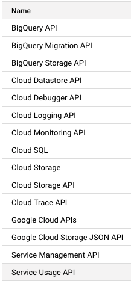

# Setup instructions

You will find below the instructions to set up your computer for [Le Wagon Data Engineering course](https://www.lewagon.com/)

A part of the setup will be done on your **local machine** but most of the configuration will be done on a **virtual machine**.

Please **read instructions carefully and execute all commands in the following order**. If you get stuck, don't hesitate to ask a teacher for help :raising_hand:

We will run a **virtual machine** locally using Broadcom's well known **VMware**. 

**Why?**
- This allows us to all run an **identical setup**, independent of your underlying operating system.
- It will give us a very **similar experience to working with a VM on a cloud platform**, but without the cost of running it on the cloud: we use our own machine's power instead.
- It allows us to all run a VM with **Ubuntu**, a commonly used Linux distribution for cloud infrastructure.

The setup inside the virtual machine is largely automated with [**Ansible** 🔗](https://docs.ansible.com/), an [_Infrastructure as Code_ 🔗](https://en.wikipedia.org/wiki/Infrastructure_as_code) tool. **Ansible** is used to configure linux machines with specific settings and software. Perfect for fine-tuning the Virtual Machine you will be creating!

There are three main components to the setup!

## Part 1: Setup your local computer

In this section you'll setup your local computer and create some accounts. It will include:
1. Create some accounts: GitHub, Broadcom (to download VMware).
1. Install **Visual Studio Code (VS Code)**
1. Create your virtual machine with **VMware** and connect to it with **VS Code**!

## Part 2: Configure your Virtual Machine Part 1

All parts of this section happen on your virtual machine.

This section includes:
1. Authenticate your virtual machine with `gcloud`
2. Download and run an **Ansible** playbook to partially configure your virtual machine
3. Login to the Github command line tool on your virtual machine
4. Copy the Le Wagon recommended **dotfiles**. **Dotfiles** are settings that will enhance your terminal and developer experience!

## Part 3: Configure your Virtual Machine Part 2

All parts of this section happen on your virtual machine.

In this section you will:
1. Download and run a second **Ansible** playbook for some more VM fine tuning
2. Test your set up to make sure that everything has installed correctly
3. Create isolated python environments for all your challenges

Don't worry, we'll go into more detail in each of the individual sections 👌

---

There will be copying and pasting of terminal commands in this Setup Guide. There is no expectation that you understand everything that is happening.

🎯 The goal of the session is to get your VM set up correctly and completely so you can fully focus on learning in future sessions, not dealing with lingering setup issues!

Let's start :rocket:

# Part 1: Local Setup


## GitHub account

Have you signed up to GitHub? If not, [do it right away](https://github.com/join).

:point_right: **[Upload a picture](https://github.com/settings/profile)** and put your name correctly on your GitHub account. This is important as we'll use an internal dashboard with your avatar. Please do this **now**, before you continue with this guide.


:point_right: **[Enable Two-Factor Authentication (2FA)](https://docs.github.com/en/authentication/securing-your-account-with-two-factor-authentication-2fa/configuring-two-factor-authentication#configuring-two-factor-authentication-using-text-messages)**. GitHub will send you text messages with a code when you try to log in. This is important for security and also will soon be required in order to contribute code on GitHub.


## Google Cloud Platform setup

[GCP](https://cloud.google.com/) is a cloud solution that you are going to use in order to work on a virtual machine.

### Project setup

- Browse to the [Google Cloud Console](https://console.cloud.google.com/) and login with your Google / Gmail account.
- In the Cloud Console, on the project list, select the Cloud project you were invited to.


### Account language

In order to facilitate the following of the instructions during the bootcamp, open your GCP account preferences:

https://myaccount.google.com/language

If the *preferred language* is not:
- **English**
- **United States**

Then switch the language to english:
- Click on the edit pen logo
- Select **English**
- Select **United States**
- Click on **Select**

## GCP APIs

When you create a GCP Project, not every service is enabled by default. To enable a service (like using a VM or storing a Docker image in Artifact Registry) you have to enable the GCP API for that service.

### Default APIs

Go to your project [APIs dashboard 🔗](https://console.cloud.google.com/apis/dashboard), you can see a bunch of APIs are already enabled:



### Enable additional APIs

You'll need to enable some additional API's so that Terraform can create cloud resources on your behalf.

**Cloud Resource Manager**

On the [APIs dashboard 🔗](https://console.cloud.google.com/apis/dashboard) page, click on [Enable APIs and services 🔗](https://console.cloud.google.com/apis/library) and make sure your project is selected in the box in the top left.

In the search box, search for: _cloud resource manager api_ and select the **Cloud Resource Manager API**. On the next page, click on **Enable**.

**Service Usage**

Navigate back to the [APIs and Services 🔗](https://console.cloud.google.com/apis/library) page and search for: _service usage api_ and select the top result: **Service Usage API**. On the next page, click on **Enable**. ❗ This API might already be enabled - not a problem if it is!

**Compute Engine**

Navigate back to the [APIs and Services 🔗](https://console.cloud.google.com/apis/library) page and search for: _compute engine api_ and select: **Compute Engine API**. On the next page, click on **Enable**. ❗ This API might already be enabled - not a problem if it is!


## Visual Studio Code

### Installation

Let's install [Visual Studio Code](https://code.visualstudio.com) text editor.

- Go to [Visual Studio Code download page](https://code.visualstudio.com/download).
- Click on "Windows" button
- Open the file you have just downloaded.
- Install it with few options:


When the installation is finished, launch VS Code.


### VS Code Remote SSH Extension

We need to connect VS Code to a virtual machine in the cloud so you will only work on that machine during the bootcamp. A pretty useful [**Remote SSH Extension**](https://marketplace.visualstudio.com/items?itemName=ms-vscode-remote.remote-ssh) is available on the VS Code Marketplace.

- Open VS Code > Open the [command palette](https://code.visualstudio.com/docs/getstarted/userinterface#_command-palette) > Type `Extensions: Install Extensions`

- In the left pop out panel that appears, type `remote ssh` into the search bar, and select the first result: **Remote - SSH** (by Microsoft)

  

- Install the extension by clicking on the install button

  

That's the only extension you should install on your _local_ machine, we will install additional VS Code extensions on your _virtual machine_.


## Download Ubuntu ISO

In a later step we will install Ubuntu on our VM, so we need an installation image (ISO). Let's start downloading it already because it is almost 3 Gb!


Your machine most probably has an Intel or AMD processor. Then download [this ISO image](https://releases.ubuntu.com/noble/ubuntu-24.04.4-live-server-amd64.iso) to your Downloads folder.

In the (rather unlikely) case you'd have an ARM based processor (Snapdragon X), download [this ISO image](https://cdimage.ubuntu.com/ubuntu/releases/24.04/release/ubuntu-24.04.4-live-server-arm64.iso) to your Downloads folder.


While the image is downloading, continue with the next step.


## VMware installation

VMware will allow us to run virtual machines on our machine.

### Registration

Browse to [Broadcom's website](https://profile.broadcom.com/web/registration) and create an account.

Once you created your account, click on the **Login** button, or follow [this link](https://access.broadcom.com), to sign in.

### Download and install VMware


1. **Browse** to this link: [VMware Workstation Pro](https://support.broadcom.com/group/ecx/productdownloads?subfamily=VMware%20Workstation%20Pro&freeDownloads=true).


1. Click on the link for the **26H1** version for your platform. This will take you to the next page.

1. Below the filters but above the file list, you will have to **agree to the Terms and Conditions**. You can only check the box after you followed the link to the Terms and Conditions.

1. The first time you download VMware, you will be asked for some **additional registration details**. Complete these.

1. Then **click on the download button** (a blue cloud icon). If you don't see the download button, scroll far enough to the right.

1. Once the download finished, **open the file, and install** the application.


## Create the VM


1. In the application, **click on the button with the big `+` and *Create a New Virtual Machine**.
1. Stick to the pre-selected *Typical* configuration, and click on *Next*.
1. In the next step, browse to the **ISO** you downloaded earlier, and click on *Next*.
1. Leave the default options for the **VM name**, and click on *Next*.
1. Leave the default options for the **VM location**, and click on *Next*.
1. Increase the **disk capacity** to *30 Gb*, and click on *Next*.
1. In the **Ready to Create Virtual Machine**, click on *Finish*.


### Launch the VM and Install Ubuntu


1. While the machine boots up, you will probably be asked something about side channel mitigations. Just click on *OK*.
1. Same when asked about removable devices.


From now on you'll have to navigate using the arrows, the `<Tab>`, and the `<Enter>` key on your keyboard. Old school!


#### Configure the machine

We'll guide you through the screens step by step.

1. Stick to the default option to **launch Ubuntu**, the first option, and hit `<Enter>` on your keyboard.

1. You'll see lots of messages appear. After a bit you'll be prompted to choose a **language**. Choose *English* and `<Enter>`.

1. You will be asked if you want to update to 26.04. No because we want to stick to Ubuntu 24.04. Choose ***Continue without updating*** and `<Enter>`.

1. In the next step, select your **keyboard** layout, or use `Identify keyboard` if you don't know. Finally select *Done* and hit `<Enter>`.

1. In the next screen, *Choose the **base** for the installation*, choose *Ubuntu Server* and then *Done* and `<Enter>`.

1. In the next step, **network configuration**, stick to the default option, and `<Enter>`.

1. In the next step, **proxy**, just `<Enter>`.

1. Then it will start **testing** if it can connect to the internet to check the Ubuntu archives. Wait until above the rectangle it says *This mirror location passed tests*. Then hit `<Enter>`.

1. In the next step, **storage**, just hit `<Enter>`.

1. In the **summary** screen, hit `<Enter>`.

1. Then you'll be asked to **continue**. Use the arrows to select *Continue* and then `<Enter>`.

#### Create a user account

In the next step, we'll give our machine a name, and define your username and password.

> :rotating_light: Write down everything you input here! :rotating_light:

When you completed a field, use `<Enter>` to jump to the next one.

- **Your name**: This is just a friendly name. Your first name will do.
- **Your server name**: use `myvm`.
- **Username**: use your first name, in lowercase.
- **Password**: up to you, pick something easy you'll remember like the password for your physical machine or something short. Nobody has access to your VM unless they already have access to your physical machine anyway.

#### Continue the configuration

1. In the next screen, **Ubuntu Pro**, keep the default option to *Skip for now*. We don't need it.

1. In the screen asking about **OpenSSH**, make sure to have an X next to *Install OpenSSH Server* by hitting `<Space>` on your keyboard. Then arrow down to select *Done* and `<Enter>`.

1. In the next screen, it asks to install popular **snaps**. We don't want that. Just arrow down to select *Done* and `<Enter>`.

#### Now wait: Ubuntu is being installed

At this point, you will see a long list of messages scroll by while Ubuntu is being installed. Time to wait. It might take many minutes, sometimes without a change on the screen. If you're in doubt, arrow down to see the *Full log* and hit `<Enter>`. This one should change more frequently.

At a certain point you'll see *Installation complete* in the orange bar at the top of the screen. If you're in the full log, select *Close* and `<Enter>`.

Finish by selecting *Reboot Now* and `<Enter>`. This will reboot your VM, not your physical machine.

When it says *Please remove the installation medium*, hit `<Enter>`, even if it gives a warning about being unable to unmount the cdrom.

Your machine will now reboot.

#### Logging in to the machine

After the reboot it will ask for your login. That is the **username** you specified. Your first name in lowercase is what we suggested.

Then your **password**. Normally the same as your physical machine. Type it in. Nothing will appear, that's normal. It doesn't show anything for security reasons: someone watching along won't even know how long your password is!

After hitting `<Enter>`, you should be logged in. You'll see a lot of the text, and at the end you should see the prompt of your VM:

```bash
yourusername@myvm:~$
```

Congratulations! You have installed your VM and logged into it!


### Setting up OpenSSH

We will need this to be able to use SSH to connect to our VM.

> Because we are using VMware locally, we don't really need this. But we want to make a setup that is almost identical as if you were using a VM running on the cloud. That's why we'll use SSH.

Still **inside your VM**, run `hostname -I`. Take note of the IP address that is shown.

<details>
  <summary>Troubleshooting if it doesn't work
  </summary>

  Make sure OpenSSH is running: `sudo systemctl status ssh`.

  If the server isn’t running, start it using: `sudo systemctl start ssh`.

  If it's not installed, install it using: `sudo apt install openssh-server`. Then go back in the reverse order.

</details>

Now, let's try to connect from your local machine's terminal to be sure everything works.


The following instructions assume you are using **Powershell** or **Windows Powershell**, not the basic *Command Prompt*. Normally you should already have one of both on your Windows machine.

:warning: **If you have WSL** on your Windows machine, make sure to open a (Windows) Powershell prompt, not an Ubuntu or other linux prompt!


In **your local terminal**:

```bash
# Replace username with your firstname
# Replace ipadddress with the IP address you obtained above
ssh username@ipaddress
```

You might be asked *Are you sure you want to continue connecting (yes/no/[fingerprint])?*. Type in `yes` and `<Enter>`.

You should see your prompt change. If asked for a password, type the password you chose for your VM and `<Enter>`. Nothing will appear on the screen while you type, that's normal. 

Let's check if you're in the VM:

```bash
hostname
```

This should return the name you gave to your VM: `myvm`.

Finally, exit, to disconnect from the VM and go back to your physical machine:

```bash
exit
```


## SSH key

We want to safely communicate with your virtual machine using [SSH protocol](https://en.wikipedia.org/wiki/Secure_Shell). We need to generate a SSH key to authenticate.

- Open your **local** terminal.


  Again, make sure you use *(Windows) PowerShell*.


- Create a **SSH key**


  ```bash
  # replace "yourfirstname" with ... your first name
  ssh-keygen.exe -t ed25519 -f $HOME/.ssh/vmware -C "yourfirstname@local"

  ```


  You should get the following message: `> Generating public/private algorithm key pair.`

- You should be asked to `Enter passphrase for "..."` - continue without a passphrase: press `<Enter>` without typing anything when asked to enter a passphrase.

- You should be asked to `Enter same passphrase again`, hit `<Enter>` again.

  You will see some lines with a sort of graphic output, ending with a line containing `+----[SHA256]-----+`. That's expected.

- Now we'll **copy the ssh key into the VM**. Tip: prepare these commands in a text editor like Notepad or VS Code, then copy-pase. Don't try to assemble them in the terminal.


  ```bash
  # Replace yourusername by your first name (lowercase)
  # Replace the numbers by the IP address of your VM
  cat $HOME/.ssh/vmware.pub | ssh yourusername@172.16.999.999 'cat >> .ssh/authorized_keys'
  ```


- You might be prompted `Are you sure you want to continue connecting (yes/no/[fingerprint])?`. Type in `yes` and `<Enter>`.

- Next you will be prompted for your password. That's the password you chose for the VM. We recommended you to use the same as for your physical machine. Type it. Nothing will appear, that's normal. Then `<Enter>`.


- Let's try to login: run this command:

  ```bash
  # Replace yourusername by your first name (lowercase)
  # Replace the numbers by the IP address of your VM
  ssh -i $HOME/.ssh/vmware yourusername@172.16.999.999
  ```

- Your prompt will change: you are now inside the VM!

- Check it by running `hostname` followed by `<Enter>`. It should say `myvm` (unless you chose another name for your vm earlier).

All good!

Type `exit` to get back to your local machine.


## Virtual Machine connection

### Configuring the remote connection

- Open VS Code > Open the [command palette](https://code.visualstudio.com/docs/getstarted/userinterface#_command-palette) > Type `Remote-SSH: Connect to Host...`

  

- Click on `Add a new host`

- Type `ssh -i ~/.ssh/vmware <username>@<ip address>`, for instance, my username is `itisi`, my VM has an IP of `172.16.999.999`: I'll type `ssh -i ~/.ssh/vmware itisi@172.16.999.999`

  

- When prompted to `Select SSH configuration file to update`, pick the one in your home directory, under the `.ssh` folder, `C:\Users\<username>\.ssh\config` basically. Usually VS Code will automatically pick the best option, so the default should work.

  

- You should get a pop-up on the bottom right notifying you the host has been added

  

- Open again the [command palette](https://code.visualstudio.com/docs/getstarted/userinterface#_command-palette) > Type `Remote-SSH: Connect to Host...` > Pick your VM IP address

  

- The first time, VSCode might ask you for a security permission like below, say yes / continue.

  

- Open again the [command palette](https://code.visualstudio.com/docs/getstarted/userinterface#_command-palette) > Type `Terminal: Create New Terminal (in active workspace)` > You now have a Bash terminal in your virtual machine!

  
  <br>
  


### Giving the remote connection a human-friendly name

Still on your *local* computer, lets create a more readable version of your machine to connect to!

```bash
code $HOME/.ssh/config
```

You should see something like the following:

```bash
Host <machine ip>
  HostName <machine ip>
  IdentityFile <file path for your ssh key>
  User <username>
```

You can now change Host to whatever you would like to see as the name of your connection or in terminal with `ssh <Host>`!

❗️ It is important that the `Host` alias does not contain any whitespaces ❗️

```bash
# For instance
Host "vmware-myvm"
  HostName 172.16.999.999 # replace with your VM's public IP address
  IdentityFile <file path for your ssh key>
  User <username>
```

Congratulations, the setup of your local computer is complete 🎉 We just need to fine tune your Virtual Machine 🪛

---

# Part 2: Configure your Virtual Machine 1

🚨🚨🚨 **All following terminal commands will be run from within your virtual machine terminal, via VS Code** 🚨🚨🚨


## Google Cloud CLI

Install the `gcloud` CLI to communicate with [Google Cloud Platform](https://cloud.google.com/) through your terminal:
```bash
sudo apt-get update && sudo apt-get install ca-certificates gnupg curl
curl https://packages.cloud.google.com/apt/doc/apt-key.gpg | sudo gpg --dearmor -o /usr/share/keyrings/cloud.google.gpg
echo "deb [signed-by=/usr/share/keyrings/cloud.google.gpg] https://packages.cloud.google.com/apt cloud-sdk main" | sudo tee -a /etc/apt/sources.list.d/google-cloud-sdk.list
sudo apt-get update && sudo apt-get install google-cloud-cli
```
👉 [Install documentation](https://cloud.google.com/sdk/docs/install#deb)


### Authenticate gcloud

We need to authenticate the `gcloud` CLI tool and set the project so it can interact with Google from the terminal.

To authenticate `gcloud`, run:

```bash
gcloud auth login
```

And following the prompts.

When selecting what **Google Auth Library** can access, ensure that you allow:

> ✅ See, edit, configure and delete your Google Cloud data and see the email address for your Google Account

It's is usually the first check box.

We recommend allowing **Google Auth Library** to: _View and sign in to your Google Cloud SQL instances._


For pasting into the terminal, your might need to use `ctrl + shift + v`


You also need to set the GCP project that your are working in. For this section, you'll need your **GCP Project ID**, which can be found on the GCP Console at this [link here 🔗](https://console.cloud.google.com). Makes sure you copy the _Project ID_ and **not** the _Project number_.

To set your project, replace `<YOUR_PROJECT_ID>` with your GCP Project ID and run:

```bash
gcloud config set project <YOUR_PROJECT_ID>
# gcloud config set project my-gcp-project
```

💡 If you get a terminal message saying your project: _lacks an environment tag_ - you can safely ignore it

Confirm your setup with:

```bash
gcloud config list
```

You should get an output similar to:

```bash
[core]
account = taylorswift@domain.com # Should be your GCP email
disable_usage_reporting = True
project = my-gcp-project # Should be your GCP Project ID

Your active configuration is: [default]
```


### Application Default Credentials

Application Default Credentials are for authenticating our **code** (Terraform and Python 🐍) to interact with Google services and resources. It's a small distinction between `gcloud` and **code**, but an important one.

To authenticate your **Application Default Credentials**, in your terminal run:

```bash
gcloud auth application-default login
```

And follow the prompts. It should open a web-page to login to your Google account.


## VM configuration with Ansible

We'll be using [Ansible 🔗](https://docs.ansible.com/ansible/latest/getting_started/introduction.html) to configure your Virtual Machine with some software, configurations, packages, and frameworks that you'll use in the bootcamp.

Let's start by installing ansible:

```bash
sudo apt install ansible-core
```

Then, in your terminal run:

```bash
ansible --version
```

You should get an output similar to (some version numbers might change, that's fine):

```
ansible [core 2.19.5]
  config file = /etc/ansible/ansible.cfg
  configured module search path = ['/home/tswift/.ansible/plugins/modules', '/usr/share/ansible/plugins/modules']
  ansible python module location = /usr/lib/python3/dist-packages/ansible
  ansible collection location = /home/tswift/.ansible/collections:/usr/share/ansible/collections
  executable location = /usr/bin/ansible
  python version = 3.12.3 (main, Feb  4 2025, 14:48:35) [GCC 13.3.0] (/usr/bin/python3)
  jinja version = 3.1.2
  libyaml = True
```

❗ If not, raise a ticket with a teacher 🙋

### Ansible Playbook 1

Create a folder and download the ansible files:

```bash
mkdir -p ~/vm-ansible-setup/playbooks
```

```bash
curl -L -o ~/vm-ansible-setup/ansible.cfg https://raw.githubusercontent.com/lewagon/data-engineering-setup/refs/heads/vmware-automation/automation/vm-ansible-setup/ansible.cfg \
&& curl -L -o ~/vm-ansible-setup/hosts https://raw.githubusercontent.com/lewagon/data-engineering-setup/refs/heads/vmware-automation/automation/vm-ansible-setup/hosts \
&& curl -L -o ~/vm-ansible-setup/playbooks/setup_vm_part1.yml https://raw.githubusercontent.com/lewagon/data-engineering-setup/refs/heads/vmware-automation/automation/vm-ansible-setup/playbooks/setup_vm_part1.yml
```

And run with:

```bash
cd ~/vm-ansible-setup && ansible-playbook -K playbooks/setup_vm_part1.yml
```

You will be asked for a password, enter your password for the VM user. This is because some of the installation steps require `sudo` access.

And the playbook should start running!

❗ If an error occur, raise a ticket with a teacher. The ansible playbooks are designed so that they can be run again, and again, and again and only make the changes that are required (a cool concept called _Idempotency_ that you'll learn about later 😉).

### What is the playbook installing?

While this playbook is running, lets go through what is being installed and configured:
- Updating system packages. Ubuntu (and other Debian based linux distributions) uses the `apt` package manager
- Changing the default shell from **bash** to **zsh**, a more customizable shell that is extensible and looks great!
- Installing the [**Oh-My-ZSH** 🔗](https://ohmyz.sh/) plugin for the **zsh** shell. We'll use it a bit later to add some quality of life plugins and extensions to `zsh`
- Installing [**Docker** 🔗](https://www.docker.com/) on your Virtual Machine. Docker is an open platform for developing, shipping, and running applications. You will use it throughout the bootcamp
- Installing [**Terraform** 🔗](https://developer.hashicorp.com/terraform). **Terraform** is an Infrastructure as Code (IaC) tool
- Install the [**GitHub CLI** 🔗](https://cli.github.com/): the CLI tool that we'll use to interact with your GitHub account directly from the terminal

The playbook is also running checks to see if things are installed or not. This is so you can safely re-run the playbook without any problems.

💡 Curious about how Ansible playbooks are defined, take a look at the playbooks' source code at this [link here 🔗](https://github.com/lewagon/data-engineering-setup/blob/main-automation/automation/vm-ansible-setup/playbooks/setup_vm_part1.yml). You might not understand exactly what is happening, but should be able to identify the different tasks.


## GitHub CLI

CLI is the acronym of [Command-line Interface](https://en.wikipedia.org/wiki/Command-line_interface).

In this section, we will use [GitHub CLI](https://cli.github.com/) to interact with GitHub directly from the terminal.

It should already be installed on your computer from the previous commands.

We will use the GitHub CLI (`gh`) to connect to GitHub using *SSH*, a protocol to log in using SSH keys instead of the well known username/password pair.

First in order to **login**, copy-paste the following command in your terminal:

:warning: **DO NOT edit the `email`** — Even though `user:email` looks like a placeholder for your actual email address, it isn't — do not replace it.

```bash
gh auth login -s 'user:email' -w --git-protocol ssh
```

`gh` will ask you few questions:

- `Generate a new SSH key to add to your GitHub account?` Press `Enter` to ask gh to generate the SSH keys for you.

  If you already have SSH keys, you will see instead `Upload your SSH public key to your GitHub account?` With the arrows, select your public key file path and press `Enter`.

- `Enter a passphrase for your new SSH key (Optional)`:
  - **FOR MOST PEOPLE:** Just press `Enter` to skip. You don't need a passphrase for the bootcamp and it would prompt you every time you use the key. There is a risk, however, that if someone steals your laptop, they could then push to GitHub.
  - **IF SECURITY IS REALLY IMPORTANT TO YOU:** Enter a passphrase of your choice and press `Enter`. It's _really_ important that if you enter a passphrase, you write it down somewhere immediately and do not lose/forget it. You will need to enter this frequently.

- `Title for your SSH key`. You can leave it at the proposed "GitHub CLI", press `Enter`.

You will then get the following output:

```bash
! First copy your one-time code: 0EF9-D015
- Press Enter to open github.com in your browser...
```

Select and copy the code (`0EF9-D015` in the example), then press `Enter`.

Your browser will open and ask you to authorize GitHub CLI to use your GitHub account. Accept and wait a bit.

Come back to the terminal, press `Enter` again, and that's it.

To check that you are properly connected, type:

```bash
gh auth status
```

:heavy_check_mark: If you get `Logged in to github.com as <YOUR USERNAME> `, then all good :+1:

:x: If not, **contact a teacher**.


## Dotfiles

Let's enhance the developer experience on your Virtual Machine by installing Le Wagon's pre-configured [dotfiles 🔗](https://github.com/lewagon/dotfiles) for your terminal, zsh and VS Code.

To customise this configuration for yourself, you'll need to **fork** the repository to your own Github account.

**Forking** creates a copy of the repository under your account (`your_github_username/dotfiles`), which you can then modify with your personal information, such as your name.

<details>
<summary>❗ I started a Le Wagon <strong>Web Development</strong> or <strong>Data Science</strong> bootcamp in 2021 or earlier. ❗</summary>

You may have a older version of the Le Wagon dotfiles. The second Ansible playbook will try to modify some of these dotfiles.


Open a ticket with a TA and do one of the following:
- Compare your existing dotfiles with the current Le Wagon [dotfiles 🔗](https://github.com/lewagon/dotfiles), particularly the `.zshrc` and `settings.json` - if there is no meaningful difference, continue with the setup.
- If you are OK with losing your existing dotfiles - delete your existing dotfiles repository on GitHub and continue with the setup
- If you do not want to lose your existing dotfiles, we recommend working with branches:
    - On your **laptop**, or wherever you have a **local** copy of **your existing version of dotfiles**
    - Create a branch of your existing dotfiles setup, and push to GitHub - `origin <branchname>`
    - On `local main` (or a new named branch), pull from `upstream main`, resolve any conflicts, commit, and push. It is important that you accept incoming changes to the `.zshrc` and `settings.json` files
    - Continue with the setup
        - If you pulled from `upstream main` to a new named branch, change to that branch before executing the dotfiles installer: `install.sh`.
        - Open `git_setup.sh` in a text editor and comment out or remove the lines that push to `origin main`
</details>

<br>

Open your terminal on your VM and run the following command:

```bash
export GITHUB_USERNAME=`gh api user | jq -r '.login'`
echo $GITHUB_USERNAME
```

You should see your Github username printed.

❗ If you do not see your Github username being printed - **stop here** - and raise a ticket with a TA 🙋 There may be a problem with the previous step (`gh auth`).

To fork the Le Wagon dotfiles repository and clone it on your Virtual Machine. Execute the following command:

```bash
mkdir -p ~/code/$GITHUB_USERNAME && cd $_
gh repo fork lewagon/dotfiles --clone
```

Run the `dotfiles` installer with:

```bash
cd ~/code/$GITHUB_USERNAME/dotfiles && zsh install.sh
```

Check the emails registered with your GitHub Account. You'll need to pick one on the next step:

```bash
gh api user/emails | jq -r '.[].email'
```

Run the git installer:

```bash
cd ~/code/$GITHUB_USERNAME/dotfiles && zsh git_setup.sh
```

:point_up: This will **prompt** you for your name (`FirstName LastName`) and your email.

:warning: You **need** to put one of the emails listed above from the previous `gh api ...` command.
If you do not enter a valid email, Kitt will not be able to track your progress.

💡 Select the `...@users.noreply.github.com` address if you don't want your email to appear in public repositories you may contribute to.


---

Once you have finished installing the **dotfiles**, kill your terminal (little trash can at the top right of the terminal window) and re-open it. You might have to do it a few times until it looks similar to:


The terminal should read as `zsh`.


# Part 3: Configure your Virtual Machine 2

## VM configuration with Ansible - Part 2

### Ansible Playbook 2

We'll be using a second **Ansible** playbook to further configure your Virtual Machine.

Start by downloading the ansible playbook:

```bash
curl -L -o ~/vm-ansible-setup/playbooks/setup_vm_part2.yml https://raw.githubusercontent.com/lewagon/data-engineering-setup/refs/heads/vmware-automation/automation/vm-ansible-setup/playbooks/setup_vm_part2.yml
```

And run with:

```bash
cd ~/vm-ansible-setup && ansible-playbook -K playbooks/setup_vm_part2.yml
```

And the playbook should start running! If you're asked if you want VS Code to behave more like Sublime Text, click accept.

❗ **If you created a password for your GitHub SSH key**
- You may be asked to type in your password during the playbook run
- The task: **Clone data-engineering-challenges from your GitHub to VM** will fail. This is OK and expected with how SSH keys work and how the playbooks are modifying your configuration. To resolve, in your terminal run: `exec zsh`, and then re-run the playbook.

❗ If any other errors occur, or you are unsure, raise a ticket with a teacher. You can safely run the playbook again and again. Generally, if the playbook runs from start to finish with no errors, everything should be good!

### What is the playbook installing?

While the playbook is running, let's go through what is being installed and configured.

**Python and Poetry**

Ubuntu 24.04 has Python pre-installed, but not the version we're going to use. We are going to use Python [3.12.8](https://www.python.org/downloads/release/python-3128/)

- Install [**pyenv** 🔗](https://github.com/pyenv/pyenv) and [**pyenv-virtualenv** 🔗](https://github.com/pyenv/pyenv-virtualenv). We'll use **pyenv** to manage the Python versions installed on the VM
- Install Python 3.12.8 with pyenv
- Install [**pipx** 🔗](https://pipx.pypa.io/stable/): Pipx is used to install python packages we want _globally_ available while still using virtual environments, like Poetry!
- Installing a few global python packages with **pipx**:
    - [**Poetry** 🔗]((https://python-poetry.org/)): Poetry is a modern Python package manager we will use throughout the bootcamp.
    - [**Ruff** 🔗]((https://docs.astral.sh/ruff/)): Ruff Is used to format and lint Python code.
    - [**tldr** 🔗]((https://github.com/tldr-pages/tldr)): tldr has much more readable version of `man` pages. Useful for quickly finding out how a program works.

**VS Code Configuration**

- Installing some **VS Code** extensions, but only on your VM. Here's a list of the extensions that are being installed:
    - [Sublime Text Keymap and Settings Importer](https://marketplace.visualstudio.com/items?itemName=ms-vscode.sublime-keybindings)
    - [VSCode Great Icons](https://marketplace.visualstudio.com/items?itemName=emmanuelbeziat.vscode-great-icons)
    - [Python](https://marketplace.visualstudio.com/items?itemName=ms-python.python)
    - [Python Indent](https://marketplace.visualstudio.com/items?itemName=KevinRose.vsc-python-indent)
    - [Pylance](https://marketplace.visualstudio.com/items?itemName=ms-python.vscode-pylance)
    - [YAML](https://marketplace.visualstudio.com/items?itemName=redhat.vscode-yaml)
    - [Containers](https://marketplace.visualstudio.com/items?itemName=ms-azuretools.vscode-containers)
    - [Even Better TOML](https://marketplace.visualstudio.com/items?itemName=tamasfe.even-better-toml)
- Update the VS Code Python Interpreter path.

**Shell and System Configuration**

- Create the **direnv** poetry function. The same one from the lecture! This makes it easier to work with poetry.
- Adding some **Oh-My-ZSH** Plugins: by modifying your `.zshrc` file. Here's a list of the extra plugins:
    - **pyenv**: Auto-complete for pyenv, a tool used to manage python virtual environments
    - **gcloud**: Auto-complete for the gcloud CLI tool
    - **ssh-agent**: Saves your SSH password so you only have to enter it once per session.
    - **direnv**: A tool to load `.envrc` files when you `cd` into a directory. Great for loading environment variables.

**Data Engineering Challenges Repository**

The challenges that you'll be working on throughout the bootcamp! The playbook is forking the **data-engineering-challenges** repository from **lewagon** to your own GitHub user. Then cloning that repository from your GitHub account down onto your Virtual Machine.

💡 Curious about how Ansible playbooks are defined, take a look at the playbook being run at this [link here 🔗](https://github.com/lewagon/data-engineering-setup/blob/main-automation/automation/vm-ansible-setup/playbooks/setup_vm_part2.yml)

<details>
<summary markdown='span'>❓ Why two Ansible playbooks?</summary>

This second ansible playbook requires GitHub authorisation to fork the `lewagon/data-engineering-challenges` repository and it is also editing some of the Le Wagon recommended **dotfiles**. So we separated the process into two steps.
</details>

### Restart Virtual Machine

Once the playbook has finished running, you need to completely shutdown your Virtual Machine so that some of the configuration updates properly (specifically **pyenv** and **Docker**).

To shutdown your VM, go back to VMware.

In the menu, find *Virtual Machine*, and click on *Restart*.

Wait until the VM shows that it's rebooted. You won't have to login, because we can connect with VS Code through SSH.

It is possible that a certain point your IP address changes, and you're unable to connect.

In that case:

- In VMware, login to the machine. Your username should be your (lowercase) firstname. The password the same as your physical machine.
- Once logged in, run `hostname -I`. That will show your (new) IP address.

Back in VS Code:

- `Cmd-Shift-P` on macOS or `Ctrl-Shift-P` on Windows/Linux.
- Type in: _remote ssh config_.
- Select the option: **Remote-SSH: Open SSH Configuration File...**
- The first option is probably the correct one.
- Edit the file to replace the IP address.


## Check your Virtual Machine Setup

We've used two ansible playbooks to configure our Virtual Machine. Let's run some manual checks in the terminal to make sure that everything has installed correctly.

❗ If any of these checks error out, raise a ticket with a TA 🙋

#### Python

🧪 To test:

```bash
python --version
```

Should return:

```bash
Python 3.12.8
```

#### Pyenv

🧪 To test:

```bash
pyenv versions
```

Should return:

```
  system
* 3.12.8 (set by /home/<your_username>/.pyenv/version)
```

❗ Note: There should be a `*` next to 3.12.8

#### Pipx

🧪 To test:

```bash
pipx list
```

Should return something similar too:

```
venvs are in /home/<your_username>/.local/share/pipx/venvs
apps are exposed on your $PATH at /home/<your_username>/.local/bin
manual pages are exposed at /home/<your_username>/.local/share/man
   package poetry 2.3.1, installed using Python 3.12.8
    - poetry
   package ruff 0.14.13, installed using Python 3.12.8
    - ruff
   package tldr 3.4.3, installed using Python 3.12.8
    - tldr
    - man1/tldr.1
```

#### Docker

🧪 To test:

```bash
docker run hello-world
```

Should return:

```
Unable to find image 'hello-world:latest' locally
latest: Pulling from library/hello-world
e6590344b1a5: Pull complete
Digest: sha256:7e1a4e2d11e2ac7a8c3f768d4166c2defeb09d2a750b010412b6ea13de1efb19
Status: Downloaded newer image for hello-world:latest

Hello from Docker!
This message shows that your installation appears to be working correctly.

To generate this message, Docker took the following steps:
 1. The Docker client contacted the Docker daemon.
 2. The Docker daemon pulled the "hello-world" image from the Docker Hub.
    (amd64)
 3. The Docker daemon created a new container from that image which runs the
    executable that produces the output you are currently reading.
 4. The Docker daemon streamed that output to the Docker client, which sent it
    to your terminal.

To try something more ambitious, you can run an Ubuntu container with:
 $ docker run -it ubuntu bash

Share images, automate workflows, and more with a free Docker ID:
 https://hub.docker.com/

For more examples and ideas, visit:
 https://docs.docker.com/get-started/
```

#### Terraform

🧪 To test:

```bash
terraform --version
```

Should return something similar to:

```
Terraform v1.14.3
on linux_amd64
```

That's all the testing we'll do for now!


## Let's Make!

Almost there! In the second ansible playbook, the `lewagon/data-engineering-challenges` repository was forked from Le Wagon to your own GitHub account (in the same way as the dotfiles). Let's review how it works.

Our setup will look a bit like this:


This allows you to work on challenges, but if any updates are made to the challenge content, you still have access to them!

Check that the `origin` and `upstream` remotes for your `data-engineering-challenges` repository are pointing at the correct repositories on GitHub, run the following:

```bash
cd ~/code/$(gh api user | jq -r '.login')/data-engineering-challenges
git remote -v
```

Should return:

```
origin  git@github.com:<your_github_username>/data-engineering-challenges.git (fetch)
origin  git@github.com:<your_github_username>/data-engineering-challenges.git (push)
upstream        git@github.com:lewagon/data-engineering-challenges.git (fetch)
upstream        git@github.com:lewagon/data-engineering-challenges.git (push)
```


## DBeaver

Download and install [DBeaver ("Community" edition) 🔗](https://dbeaver.io/download) on your local machine, a free and open source SQL Client to connect to databases, explore schema, and run **SQL queries**.


